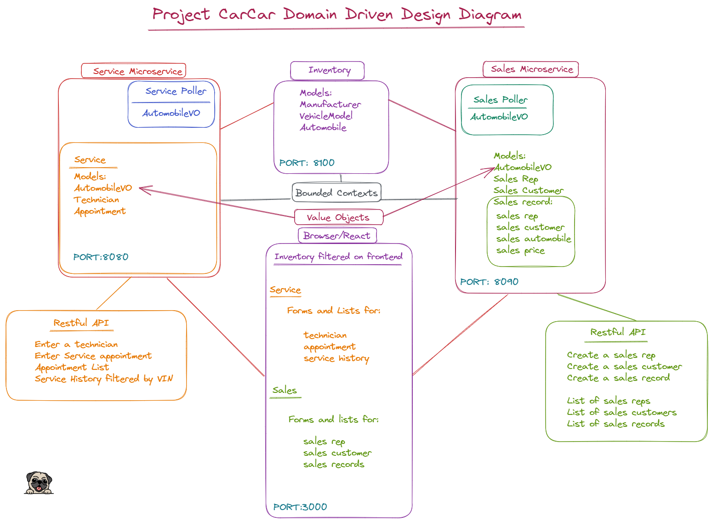

## Project CarCar

## Team:
Anthony - Service microservice

Bobby - Sales microservice


## How to run Application:

1. Fork the repository, then copy path to clone with https.

2. Open your terminal and enter: git clone <<gitlab link>>

3. Go into the project directory: CD <<project name>>

4. Open Docker; while Docker is running, use these commands in terminal.
    - docker volume create beta-data
    - docker-compose build
    - docker-compose up

5. Make migrations:
    - docker exec -it <<docker container name>> bash
    - python manage.py makemigrations
    - python manage.py migrate

6.  Open VS Code:
    - code .

7. Go to http://localhost:3000 to access webpage

## Domain Driven Design:



## Services:

# Inventory:
    - Monolith contains Manufacturers, VehicleModel, and Automobiles in inventory.

    - Inventory allows:

        - add feature for a new vehicle model to vehicle models list

            - http://localhost:3000/models/new


        - add feature for a new automobile into inventory

            - http://localhost:3000/automobiles/new


        - list feature of manufacturers; Displays:[name]

            - http://localhost:3000/manufacturer


        - vehicle models list: shows list of vehicle models; Displays: [name, manufacturer, picture]

            - http://localhost:3000/models


        - automobiles list: shows list of automobiles; Displays:[VIN, color, year, model, and manufacturer]

            - http://localhost:3000/automobiles


# Service Appointment:
    - Service appointment microservice handles and maintains information of set appointments for automobiles and its owner.

    - Service appointment allows:

        - feature for new technicians: add form for each technician [name, employee_number]

            - http://localhost:3000/technicianform/new


        - feature for new service appointments: add form to create new appointments; Displays:[VIN, owner, date/time, technician, reason]

            - http://localhost:3000/serviceappointmentform/new


        - appointment list: shows list of appointments; Displays: [VIN, owner, date/time, technician, reason, VIP, fin] appointments can be marked as canceled or finished

            - http://localhost:3000/appointmentlist


        -  Service History: allows for a filter search using VIN of specific car. Displays:[owner, date/time, technician, reason]

            - http://localhost:3000/servicehistory


        - VIP status feature: automobiles purchased from dealership will indicate VIP status.


# Sales:
The Sales application keeps track of automobile sales that come from the inventory.

    Features:
        - Add new sales rep(name and a unique employee number) then adds to sales reps list

            - http://localhost:3000/salesreps/new


        - Add new customers(name, address, and phone number) then adds to sales customers list

            - http://localhost:3000/salescustomers/


        - Add new sales record(sales price, sales customer, sales rep, automobile(vin)) then adds to sales record list

            - http://localhost:3000/salesrecords/new


        - Access to each sales rep’s sales history
            - http://localhost:3000/salesreps/

            - Sales Rep's Name
            - Sales Customer's Name
            - Automobile's VIN
            - Sale's price


        - Access to list of sales records
            - http://localhost:3000/salesrecords/

            - Sales Rep's Name
            - Employee's ID
            - Sales Customer's Name
            - Automobile's VIN
            - Sale's price


## API Documentation:


# Inventory:

Vehicle Model List:
(GET) | http://localhost:8100/api/models/
```
        {
	"models": [
		{
			"href": "/api/models/1/",
			"id": 1,
			"name": "Sebring",
			"picture_url": "https://upload.wikimedia.org/wikipedia/commons/thumb/7/71/Chrysler_Sebring_front_20090302.jpg/320px-Chrysler_Sebring_front_20090302.jpg",
			"manufacturer": {
				"href": "/api/manufacturers/1/",
				"id": 1,
				"name": "BMW"
			}
		}
	]
}
```

Create Vehicle Model:
(POST) | http://localhost:8100/api/models/

INPUT:

```
    {
  "name": "Sebring",
  "picture_url": "https://upload.wikimedia.org/wikipedia/commons/thumb/7/71/Chrysler_Sebring_front_20090302.jpg/320px-Chrysler_Sebring_front_20090302.jpg",
  "manufacturer_id": 1
}

```

OUTPUT:

```
    {
	"href": "/api/models/1/",
	"id": 1,
	"name": "Sebring",
	"picture_url": "https://upload.wikimedia.org/wikipedia/commons/thumb/7/71/Chrysler_Sebring_front_20090302.jpg/320px-Chrysler_Sebring_front_20090302.jpg",
	"manufacturer": {
		"href": "/api/manufacturers/1/",
		"id": 1,
		"name": "Chrysler"
	}
}
```

Manufacturer List:
(GET) | http://localhost:8100/api/manufacturers/

```
{
	"manufacturers": [
		{
			"href": "/api/manufacturers/1/",
			"id": 1,
			"name": "BMW"
		}
	]
}
```

Create Manufacturer
(POST) | http://localhost:8100/api/manufacturers/
INPUT:
```
{
  "name": "BMW"
}
```

OUTPUT:
```
{
	"href": "/api/manufacturers/1/",
	"id": 1,
	"name": "BMW"
}
```

Automobiles List:
(GET) | http://localhost:8100/api/automobiles/
```
{
	"autos": [
		{
			"href": "/api/automobiles/22222222222222222/",
			"id": 1,
			"color": "red",
			"year": 2012,
			"vin": "22222222222222222",
			"model": {
				"href": "/api/models/1/",
				"id": 1,
				"name": "Sebring",
				"picture_url": "https://upload.wikimedia.org/wikipedia/commons/thumb/7/71/Chrysler_Sebring_front_20090302.jpg/320px-Chrysler_Sebring_front_20090302.jpg",
				"manufacturer": {
					"href": "/api/manufacturers/1/",
					"id": 1,
					"name": "BMW"
				}
			}
		}
```

Create Automobile:
(POST) | http://localhost:8100/api/automobiles/

INPUT:
```
{
  "color": "black",
  "year": 2022,
  "vin": "1J4GZ78Y5PC574443",
  "model_id": 1
}
```

OUTPUT:
```
{
	"href": "/api/automobiles/1J4GZ78Y5PC574443/",
	"id": 7,
	"color": "black",
	"year": 2022,
	"vin": "1J4GZ78Y5PC574443",
	"model": {
		"href": "/api/models/1/",
		"id": 1,
		"name": "Sebring",
		"picture_url": "https://upload.wikimedia.org/wikipedia/commons/thumb/7/71/Chrysler_Sebring_front_20090302.jpg/320px-Chrysler_Sebring_front_20090302.jpg",
		"manufacturer": {
			"href": "/api/manufacturers/1/",
			"id": 1,
			"name": "BMW"
		}
	}
}
```

# Sales:
Sales Customers List:
(GET) | http://localhost:8090/api/salescustomers/
```
{
	"sales_customers": [
		{
			"name": "Bobby",
			"phone_number": "911"
}
```

Create Sales Customer:
(POST) | http://localhost:8090/api/salescustomers/

INPUT:
```
{
	"name": "Bobby",
	"address": "123 apples st",
	"phone_number": 91111
}
```

OUTPUT:
```
{
	"name": "Bobby",
	"address": "123 apples st",
	"phone_number": 91111
}
```

Sales Rep List:
(GET) | http://localhost:8090/api/salesreps/
```
{
	"sales_reps": [
		{
			"name": "Bobby",
			"employee_id": "1223"
}
```

Create Sales Rep:
(POST) | http://localhost:8090/api/salesreps/

INPUT:
```
{
	"name": "Bobby",
	"employee_id": 1
}
```

OUTPUT:
```
{
	"name": "Bobby",
	"employee_id": 1
}
```

Sales Records List:
(GET) | http://localhost:8090/api/salesrecords/
```
{
    "sales_price": 150000,
    "sales_customer": "Bobby",
    "sales_rep_id": "1223",
    "sales_automobile": "1GCDC14H5DS161081",
    "sales_rep_name": "Bobby"
}
```

Create Sales Record:
(POST) | http://localhost:8090/api/salesrecords/

INPUT:
```
{
  "sales_price": 150000,
  "sales_customer": "911",
  "sales_rep": "1223",
  "sales_automobile": "1GCDC14H5DS161081"
}
```

OUTPUT:
```
{
	"sales_price": 150000,
	"sales_customer": "Bobby",
	"sales_rep_id": "1223",
	"sales_automobile": "1GCDC14H5DS161081",
	"sales_rep_name": "Bobby"
}
```

# Technician

List Technician:
(GET) | http://localhost:8080/api/appointment/

OUTPUT:
```
{
	"technicians": [
		{
			"href": "/api/technician/1/",
			"name": "Maru",
			"employee_number": 7331,
			"id": 1
		},
		{
			"href": "/api/technician/2/",
			"name": "Mecha",
			"employee_number": 1337,
			"id": 2
		},
		{
			"href": "/api/technician/3/",
			"name": "Jimmy Tortilla",
			"employee_number": 1993,
			"id": 3
		}
	]
}
```

Technician Details:
(GET) | http://localhost:8080/api/technician/1/

OUTPUT:
```
{
	"href": "/api/technician/1/",
	"name": "Maru",
	"employee_number": 7331,
	"id": 1
}
```

Create Technician:
(POST) | http://localhost:8080/api/technician/

INPUT:
```
{
	"name": "Mecha",
	"employee_number": 1337
}
```

OUTPUT:
```
{
	"href": "/api/technician/2/",
	"name": "Mecha",
	"employee_number": 1337
}
```

# Appointment

List of Appointments
(GET) | http://localhost:8080/api/appointment/

OUTPUT:
```
{
	"appointments": [
		{
			"href": "/api/appointment/9/",
			"vin": "AT3ZD10V3W0192432",
			"owner": "Peggy Hill",
			"date_time": "2022-12-07T12:00:00+00:00",
			"technician": {
				"href": "/api/technician/2/",
				"name": "Mecha",
				"employee_number": 1337,
				"id": 2
			},
			"reason": "QUARTER PANEL",
			"vip": true,
			"fin": false,
			"id": 9
		},
		{
			"href": "/api/appointment/11/",
			"vin": "1HGCP2F7XAA090151",
			"owner": "",
			"date_time": "2022-12-19T17:17:00+00:00",
			"technician": {
				"href": "/api/technician/3/",
				"name": "Jimmy Tortilla",
				"employee_number": 1993,
				"id": 3
			},
			"reason": "",
			"vip": false,
			"fin": false,
			"id": 11
		},
		{
			"href": "/api/appointment/12/",
			"vin": "AT3ZD10V3W0192432",
			"owner": "Hank Hill",
			"date_time": "2022-12-07T12:00:00+00:00",
			"technician": {
				"href": "/api/technician/1/",
				"name": "Maru",
				"employee_number": 7331,
				"id": 1
			},
			"reason": "QUARTER PANEL",
			"vip": true,
			"fin": false,
			"id": 12
		}
	]
}
```
Appointment Detail
(GET) | http://localhost:8080/api/appointment/9/

OUTPUT:
```
{
    "href": "/api/appointment/9/",
    "vin": "AT3ZD10V3W0192432",
    "owner": "Peggy Hill",
    "date_time": "2022-12-07T12:00:00+00:00",
    "technician": {
        "href": "/api/technician/2/",
        "name": "Mecha",
        "employee_number": 1337,
        "id": 2
    },
    "reason": "QUARTER PANEL",
    "vip": true,
    "fin": false,
    "id": 9
}
```

Create Appointment
(POST) | http://localhost:8080/api/appointment/

INPUT:
```
{
	"vin": "AT3ZD10V3W0192432",
	"owner": "Hank Hill",
	"date_time": "2022-12-07T12:00:00+00:00",
	"technician": 7331,
	"reason": "QUARTER PANEL",
	"vip": true,
	"fin": false
}
```

OUTPUT:
```
{
	"href": "/api/appointment/12/",
	"vin": "AT3ZD10V3W0192432",
	"owner": "Hank Hill",
	"date_time": "2022-12-07T12:00:00+00:00",
	"technician": {
		"href": "/api/technician/1/",
		"name": "Maru",
		"employee_number": 7331,
		"id": 1
	},
	"reason": "QUARTER PANEL",
	"vip": true,
	"fin": false,
	"id": 12
}
```

Service History by VIN
(GET) | http://localhost:8080/api/appointment/history/FT3HP10V3W0192686/
